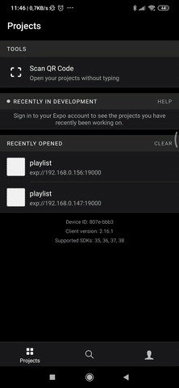

# Expo Spotify API study case

This project uses EXPO to access spotify API, listing the user's playslists and its tracks.



# Requisites
You have to configure and register your aplication at [Spotify](https://developer.spotify.com/documentation/web-api/quick-start/). 

You'll need to whitelist a redirect URI at [Spotify Dashboard](https://developer.spotify.com/dashboard). Since we are using Expo, use the URI provided in the Expo DevTools.

Get your Client ID and put in the file 'credientais.js'. 'credentials.mock.js' is provided as an exemple.

# Running
```yarn install```

```expo start```

# TODOs

- prevent going back in certains screens (it was done, but was buggy)
- add loading spinner when fetching data
- improve search modal and its filters
- add interceptor for error 401
- use virtualized list for perfomance boost
- improve list item layout


